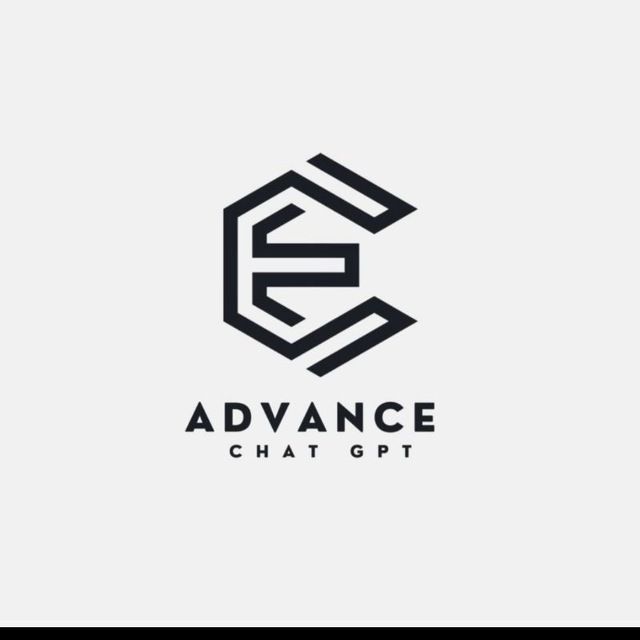

<a name="readme-top"></a>

[![Contributors][contributors-shield]][contributors-url]
[![Forks][forks-shield]][forks-url]
[![Stargazers][stars-shield]][stars-url]
[![Issues][issues-shield]][issues-url]
[![MIT License][license-shield]][license-url]
[![LinkedIn][linkedin-shield]][linkedin-url]


<!-- PROJECT LOGO -->
<br />
<div align="center">
  <a href="https://github.com/TechyCSR/AdvChatGptBot">
    
  </a>

  <h3 align="center">AdvChatGpt Bot</h3>

   <p align="center">
    An AdvanceChatGpt bot with all the features you need to make your life better !
    <br />
    <a href="https://projects.techycsr.tech"><strong>✩✩ Project by @TechyCSR ✩✩</strong></a>
    <br />
    <br />
    <a href="https://t.me/AdvChatGptbot">▶▶ View Demo ◀◀</a>
  </p>
</div>


<!-- TABLE OF CONTENTS -->
<details>
  <summary>Table of Contents</summary>
  <ol>
    <li>
      <a href="#about-the-project">About The Project</a>
    </li>
    <li>
      <a href="#getting-started">Getting Started</a>
      <ul>
        <li><a href="#Requirements">Requirements</a></li>
        <li><a href="#Run">Run</a></li>
      </ul>
    </li>
    <li><a href="#roadmap">Roadmap</a></li>
    <li><a href="#contributing">Contributing</a></li>
    <li><a href="#license">License</a></li>
    <li><a href="#contact">Contact</a></li>
  </ol>
</details>


<!-- ABOUT THE PROJECT -->
# About The Project


Welcome to AdvChatGpt, your all-in-one AI companion designed to enhance and simplify your life. Our cutting-edge chatbot is equipped with a comprehensive set of features that cater to a wide range of needs.

## AI Queries Made Simple:
Ask any questions, and our intelligent chatbot will provide you with prompt and accurate responses. Whether you're seeking information, advice, or just engaging in casual conversation, AdvChatGpt is here to assist you. Plus, language is no barrier – our bot supports communication in multiple languages, making interaction seamless and accessible.

## Image Generation Magic:
Unleash your creativity with our image generation feature. Simply provide a prompt, and watch as AdvChatGpt transforms it into a visual masterpiece. Whether it's artistic endeavors or just for fun, the possibilities are endless.

## Voice Queries and Responses:
Experience a new dimension of interaction with our voice query and response capabilities. Ask questions, make requests, or simply engage in conversation, and AdvChatGpt will not only read but respond back to you in a natural and user-friendly voice. It's like having a virtual assistant at your beck and call.

## Innovative Image Query Support:
Take things to the next level with our unique capability to handle queries within images. Have a question about something you see in a picture? Just upload the image, and AdvChatGpt will analyze and provide insightful responses, bringing a whole new level of intelligence to visual interactions.

## AdvChatGpt is more than just a chatbot:
it's a versatile and intelligent companion designed to make your life better, providing solutions to your queries in various formats, be it text, images, or voice. Join us on this exciting journey of advanced AI interaction, where possibilities are limitless and convenience is key.

<p align="right">(<a href="#readme-top">back to top</a>)</p>


# Getting Started

## Requirements
* python 3.8+
* A Microsoft Account with early access to [http://bing.com/chat](http://bing.com/chat)
* Telegram API_ID and API_KEY from [https://my.telegram.org/apps](https://my.telegram.org/apps)
* Telegram BOT_TOKEN from [@botfather](https://t.me/botfather)
* Good practical skills and a clear mind ( Believe Me You have ) !

<details>
  <summary>

### Checking bing AI access (Required)
PS: Everyone can access Bing AI for chat now, even anonymous users.

  </summary>

- Install the latest version of Microsoft Edge
- Alternatively, you can use any browser and set the user-agent to look like you're using Edge. You can do this easily with an extension like "User-Agent Switcher and Manager" for [Chrome](https://chrome.google.com/webstore/detail/user-agent-switcher-and-m/bhchdcejhohfmigjafbampogmaanbfkg) and [Firefox](https://addons.mozilla.org/en-US/firefox/addon/user-agent-string-switcher/).
- Open [bing.com/chat](https://bing.com/chat)
- If you see a chat feature, you are good to go

</details>


<details>
  <summary>

### Getting authentication (Optional)
PS: This column is needed by image creator, or ask more questions and have longer conversations

  </summary>

- Install the cookie editor extension for [Chrome](https://chrome.google.com/webstore/detail/cookie-editor/hlkenndednhfkekhgcdicdfddnkalmdm) or [Firefox](https://addons.mozilla.org/en-US/firefox/addon/cookie-editor/) or [Edge](https://microsoftedge.microsoft.com/addons/detail/cookieeditor/neaplmfkghagebokkhpjpoebhdledlfi)
- Go to [`bing.com`](https://bing.com/)
- Open the extension
- Click "Export" on the bottom right, then "Export as JSON" (This saves your cookies to clipboard)
- Paste your cookies into a file `./cookie.json` (The filename depends on your `.env` settings)

</details>

## Install requirements
```shell
pip install -r requirements.txt
```

## Set environment variables
```shell
cp .env.example .env
```
Then edit `.env` file and set `API_ID`, `API_KEY`, `BOT_TOKEN` and `ALLOWED_USER_IDS`. Or you can set environment variables like this:
```shell
export API_ID='1234567'
export API_KEY='abcdefg2hijk5lmnopq8rstuvwxyz9'
export BOT_TOKEN='123456789:ABC-DEF1234ghIkl-zyx57W2v1u123ew11'
export ALLOWED_USER_IDS='112113115,567568569'
```

# Run
```shell
python AdvChatGptBot.py
```


<p align="right">(<a href="#readme-top">back to top</a>)</p>


<!-- ROADMAP -->
## Roadmap

- [x] AI Text Query Response
- [x] Image Generation
- [x] Text to speech & Vice versa
- [x] Image to Text
- [x] Capability to use in Groups & Personal Profile
- [x] Filter Adult content in both text & image generation
- [ ] Multi-language System Support
    - [x] English 
    - [ ] Hindi
- [ ] Previous Chat history uses


See the [open issues](https://github.com/TechyCSR/AdvChatGptBot/issues) for a full list of proposed features (and known issues).

<p align="right">(<a href="#readme-top">back to top</a>)</p>


<!-- CONTRIBUTING -->
## Contributing

If you have a suggestion that would make this better, please fork the repo and create a pull request. You can also simply open an issue with the tag "enhancement".
Don't forget to give the project a star! 

Any contributions you make are **greatly appreciated**

Thanks again!

1. Fork the Project
2. Create your Feature Branch (`git checkout -b feature/AmazingFeature`)
3. Commit your Changes (`git commit -m 'Add some AmazingFeature'`)
4. Push to the Branch (`git push origin feature/AmazingFeature`)
5. Open a Pull Request

<p align="right">(<a href="#readme-top">back to top</a>)</p>


<!-- LICENSE -->
## License

Distributed under the MIT License. See `LICENSE.txt` for more information.

<p align="right">(<a href="#readme-top">back to top</a>)</p>


<!-- CONTACT -->
## Contact

CSR - [@TechyCSR](https://twitter.com/TechyCSR) - [TechyCSR.tech](https://techycsr.tech)

Other Projects Link: [ View All Projects ](https://projects.techycsr.tech)

<p align="right">(<a href="#readme-top">back to top</a>)</p>


[contributors-shield]: https://img.shields.io/github/contributors/othneildrew/Best-README-Template.svg?style=for-the-badge
[contributors-url]: https://github.com/TechyCSR/AdvChatGptBot/graphs/contributors
[forks-shield]: https://img.shields.io/github/forks/othneildrew/Best-README-Template.svg?style=for-the-badge
[forks-url]: https://github.com/TechyCSR/AdvChatGptBot/network/members
[stars-shield]: https://img.shields.io/github/stars/othneildrew/Best-README-Template.svg?style=for-the-badge
[stars-url]: https://github.com/TechyCSR/AdvChatGptBot/stargazers
[issues-shield]: https://img.shields.io/github/issues/othneildrew/Best-README-Template.svg?style=for-the-badge
[issues-url]: https://github.com/TechyCSR/AdvChatGptBot/issues
[license-shield]: https://img.shields.io/github/license/othneildrew/Best-README-Template.svg?style=for-the-badge
[license-url]: https://github.com/TechyCSR/AdvChatGptBot/blob/master/LICENSE.txt
[linkedin-shield]: https://img.shields.io/badge/-LinkedIn-black.svg?style=for-the-badge&logo=linkedin&colorB=555
[linkedin-url]: https://linkedin.com/in/othneildrew
[product-screenshot]: images/screenshot.png
[Next.js]: https://img.shields.io/badge/next.js-000000?style=for-the-badge&logo=nextdotjs&logoColor=white
[Next-url]: https://nextjs.org/
[React.js]: https://img.shields.io/badge/React-20232A?style=for-the-badge&logo=react&logoColor=61DAFB
[React-url]: https://reactjs.org/
[Vue.js]: https://img.shields.io/badge/Vue.js-35495E?style=for-the-badge&logo=vuedotjs&logoColor=4FC08D
[Vue-url]: https://vuejs.org/
[Angular.io]: https://img.shields.io/badge/Angular-DD0031?style=for-the-badge&logo=angular&logoColor=white
[Angular-url]: https://angular.io/
[Svelte.dev]: https://img.shields.io/badge/Svelte-4A4A55?style=for-the-badge&logo=svelte&logoColor=FF3E00
[Svelte-url]: https://svelte.dev/
[Laravel.com]: https://img.shields.io/badge/Laravel-FF2D20?style=for-the-badge&logo=laravel&logoColor=white
[Laravel-url]: https://laravel.com
[Bootstrap.com]: https://img.shields.io/badge/Bootstrap-563D7C?style=for-the-badge&logo=bootstrap&logoColor=white
[Bootstrap-url]: https://getbootstrap.com
[JQuery.com]: https://img.shields.io/badge/jQuery-0769AD?style=for-the-badge&logo=jquery&logoColor=white
[JQuery-url]: https://jquery.com 
